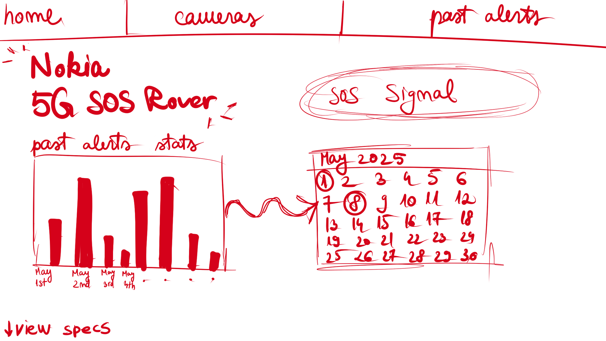
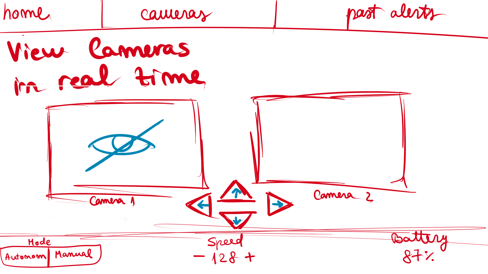
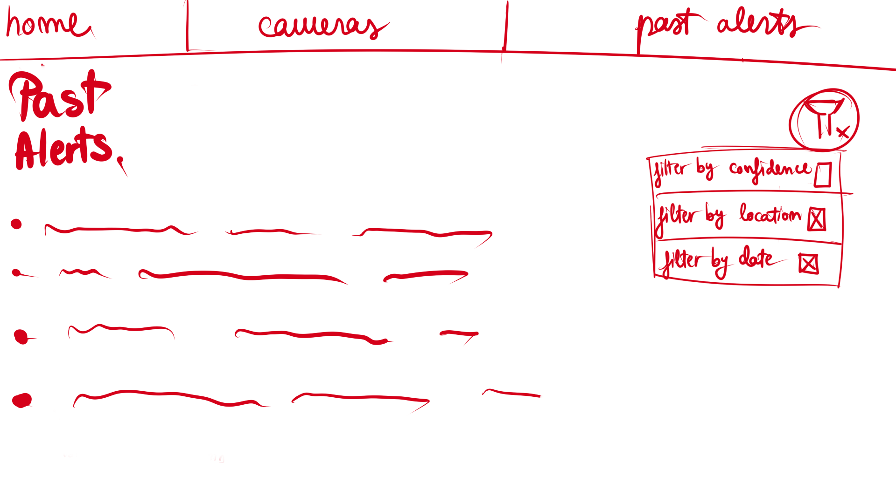

## UI/UX Draft Description

The frontend interface is designed as a desktop dashboard for the 5G SOS Rover system. The layout follows a top navigation structure. The main navigation contains three pages: Home, Cameras, and Past Alerts.

### Home Page

The Home page acts as the main overview screen. It displays the project title, “Nokia 5G SOS Rover”, and an SOS Alert pop-up. The page also includes a Past Alerts Stats section with a bar chart showing how many alerts were recorded across selected days. Next to the chart, there is a calendar widget that allows the user to select a specific date.

Below the main Home overview, the user can scroll down to view the rover specifications. This section contains information about the main components used for the rover, such as hardware parts, sensors, cameras, communication modules, and other relevant technical details.

### Cameras Page

The Cameras page is focused on viewing the rover cameras in real time. It contains two camera panels, labeled Camera 1 and Camera 2. If a camera is unavailable, the interface should show a hidden or unavailable camera icon. Below the camera views, there are directional control buttons for moving the rover.

The bottom control area includes a mode selector with Autonomous and Manual options, a speed control with minus and plus buttons, and a battery percentage indicator.

### Past Alerts Page

The Past Alerts page displays a list of previously detected SOS alerts. Each alert item should show basic information such as alert type, confidence level, location, date, and time.

On the right side of the page, there is a filter panel that allows the user to filter alerts by confidence, location, and date.

### General Design Direction

The interface should have a modern, tech-oriented look, with a clean layout, clear spacing, rounded components, and strong visual hierarchy. The design should make important information easy to notice, especially SOS signals, camera status, past alerts, rover mode, speed, battery level, and rover specifications.

## Wireframes

The following wireframes show the proposed layout for the main frontend pages.

### Home Page

### Cameras Page

### Past Alerts Page

